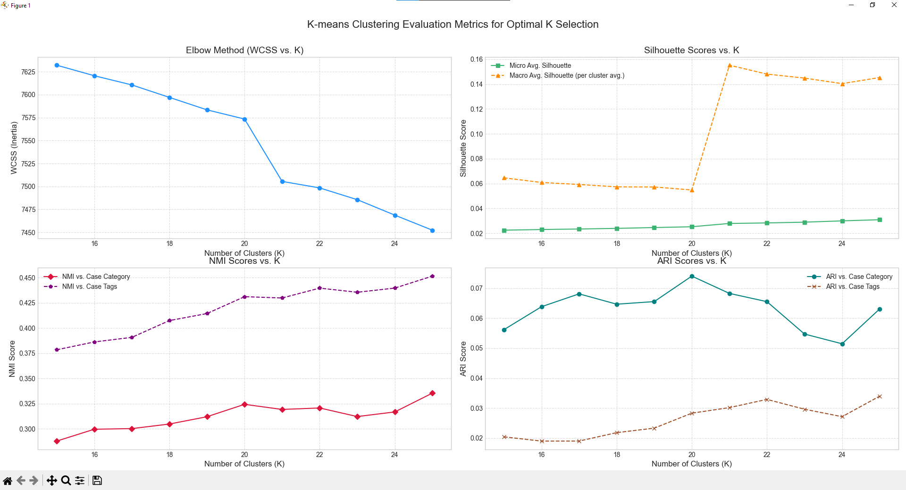

# Επιστημονική Αναφορά: Μέρος Β2 - Εξερευνητική Ανάλυση και Ομαδοποίηση Ελληνικών Νομικών Εγγράφων

**Φοιτητής/ΑΜ:** Δημοσθένης Παναγιώτης Γκοντόλιας/3220031
**Ημερομηνία:** 24 Μαΐου 2025

## 1. Εισαγωγή

Η παρούσα αναφορά συνοψίζει τις διαδικασίες και τα αποτελέσματα του Μέρους Β2, το οποίο εστιάζει στην εξερευνητική ανάλυση δεδομένων (EDA), την ομαδοποίηση (clustering) των ελληνικών νομικών εγγράφων που αναλύθηκαν στο Μέρος Β1, και την εξαγωγή περιγραφικών τίτλων για τις ομάδες που προέκυψαν με χρήση μεγάλων γλωσσικών μοντέλων (LLMs). Ο στόχος είναι η ανακάλυψη λανθανουσών δομών και θεματικών ενοτήτων στα δεδομένα.

## 2. Μεθοδολογία

**2.1 Εξερευνητική Ανάλυση Δεδομένων (EDA)**
*   Η Εξερευνητική Ανάλυση Δεδομένων (EDA) πραγματοποιήθηκε με χρήση του Jupyter Notebook `EDA.ipynb`. Η ανάλυση περιελάμβανε την εξέταση των κατανομών των δεδομένων, οπτικοποιήσεις των χαρακτηριστικών των κειμένων (π.χ. μήκος περιλήψεων, συχνότητα λέξεων) και την εξαγωγή βασικών στατιστικών για την καλύτερη κατανόηση του dataset `DominusTea/GreekLegalSum` από το Hugging Face.

**2.2 Προετοιμασία Δεδομένων για Ομαδοποίηση**
*   **Προεπεξεργασία Κειμένων:** Τα κείμενα (περιλήψεις από τη στήλη `summary` του dataset) προετοιμάστηκαν μέσω καθαρισμού από ειδικούς χαρακτήρες και χειρισμού τιμών που λείπουν (fillna('')).
*   **Διανυσματοποίηση:** Χρησιμοποιήθηκε η μέθοδος TF-IDF για τη μετατροπή των κειμένων σε διανυσματικές αναπαραστάσεις. Οι παράμετροι της `TfidfVectorizer` ήταν: `max_df=0.90` (αγνοούνται όροι που εμφανίζονται σε πάνω από το 90% των εγγράφων), `min_df=5` (αγνοούνται όροι που εμφανίζονται σε λιγότερα από 5 έγγραφα), και `ngram_range=(1, 2)` (εξετάζονται unigrams και bigrams).

## 2.3 Ομαδοποίηση με K-Means

* **Επιλογή Αριθμού Ομάδων (k):** Η τελική τιμή k επιλέχθηκε βάσει συνδυασμού μετρικών από το `k_chooser.py`:
  - Elbow method: το γόνατο (knee) εμφανίζεται στο k = 21.  
  - Silhouette score: μέγιστο στο k = 21.  
  - NMI vs case category: τοπικό μέγιστο στο k = 20, πέφτει και μετά επανέρχεται, άρα αμφίβολο.  
  - NMI vs case tags: αυξάνεται σταθερά με το k, χωρίς ορατή βέλτιστη κορυφή.  
  - ARI vs case tags: μέγιστο στο k = 20, έπειτα πέφτει· δεν εξάγει σαφές συμπέρασμα.  
  - Συμπέρασμα: δεδομένου ότι και το elbow method και το silhouette score συγκλίνουν στο k = 21 και η δομή των clusters είναι σταθερή γύρω από αυτή τη τιμή, επιλέχθηκε k = 21. Επιπλέον, οι κατηγορίες (case category) συλλαμβάνουν ευρύτερες θεματικές ομοιότητες σε σχέση με τα πιο εξειδικευμένα case tags, κάνοντας το NMI για case category πιο αξιόπιστο.
* **Εφαρμογή K-Means:**  
  - n_clusters = 21 (CHOSEN_K), init = ‘k-means++’, n_init = ‘auto’, random_state = 42.  
  - Αποτέλεσμα: κάθε έγγραφο φέρει πεδίο cluster_id, αποθηκευμένο σε `documents_with_clusters.csv`.
* **Αξιολόγηση Ομάδων:**  
  - Silhouette score και inertia παρουσιάστηκαν στο `k_chooser.py`.  
  - Το `kmeans_final.py` υλοποιεί το επιλεγμένο k και εκτυπώνει τα μεγέθη των clusters.

* **Διάγραμμα Επιλογής k:**  
  

**2.4 Εξαγωγή Τίτλων Ομάδων με LLM**
*   **Προετοιμασία Δεδομένων για LLM:** Για κάθε ομάδα που προέκυψε από τον K-Means, επιλέχθηκαν αντιπροσωπευτικά έγγραφα (οι περιλήψεις τους από τη στήλη `summary`). Δύο μέθοδοι χρησιμοποιήθηκαν για την επιλογή:
    1.  **Πλησιέστερα στο Κεντροειδές:** Επιλογή 3 εγγράφων των οποίων τα TF-IDF διανύσματα είχαν τη μικρότερη Ευκλείδεια απόσταση από το κεντροειδές της ομάδας.
    2.  **Τυχαία Επιλογή:** Επιλογή 3 τυχαίων εγγράφων από την ομάδα.
    Οι περιλήψεις αυτών των εγγράφων συνδυάστηκαν για να δημιουργηθεί ένα prompt για το LLM.
*   **Μοντέλο LLM:** Χρησιμοποιήθηκε το OpenRouter API για την πρόσβαση σε μεγάλα γλωσσικά μοντέλα. Το πρωτεύον μοντέλο ήταν το `google/gemma-3-4b-it:free`, με εναλλακτικό (fallback) μοντέλο το `meta-llama/llama-3.3-8b-instruct:free`. Η διαχείριση των κλήσεων στο LLM γίνεται μέσω του `merosB2/llm_utils.py`.
*   **Διαδικασία Εξαγωγής Τίτλων:** Για κάθε ομάδα και για κάθε μέθοδο επιλογής εγγράφων (κεντροειδές, τυχαία), στάλθηκε ένα prompt στο LLM. Το prompt ζητούσε από το μοντέλο να παράγει έναν σύντομο, περιγραφικό τίτλο (3-7 λέξεις) που να συνοψίζει το κεντρικό θέμα των παρεχόμενων περιλήψεων, ακολουθώντας τη μορφή "Θέμα:\\n\\\"<ο τίτλος σου εδώ>\\\"". Η διαδικασία αυτή υλοποιείται στο `merosB2/iii/LLM_category_title_extraction.py`. Οι παραγόμενοι τίτλοι αποθηκεύτηκαν στο αρχείο `merosB2/iii/cluster_titles_summary.csv`.

## 3. Αποτελέσματα

**3.1 Αποτελέσματα EDA**
*   Τα λεπτομερή ευρήματα, οι οπτικοποιήσεις και οι παρατηρήσεις από την Εξερευνητική Ανάλυση Δεδομένων περιέχονται στο Jupyter Notebook `EDA.ipynb`.

**3.2 Αποτελέσματα Ομαδοποίησης**
*   Ο επιλεγμένος αριθμός ομάδων `k` για την τελική ομαδοποίηση ήταν [ο αριθμός που θα συμπληρώσετε, π.χ., 21, όπως φαίνεται στο `kmeans_final.py`].
*   Οι μετρικές αξιολόγησης όπως το Silhouette score και το inertia για διάφορες τιμές του `k` υπολογίστηκαν και οπτικοποιήθηκαν στο `k_chooser.py` (π.χ., στα αρχεία `kmeans_summary_*.png`).
*   Το αρχείο `documents_with_clusters.csv` περιέχει τα αναγνωριστικά των ομάδων για κάθε έγγραφο. Τα μεγέθη των ομάδων (αριθμός εγγράφων ανά ομάδα) εκτυπώνονται κατά την εκτέλεση του `kmeans_final.py`.

**3.3 Αποτελέσματα Εξαγωγής Τίτλων**
*   Οι τίτλοι που εξήχθησαν από το LLM για κάθε ομάδα, χρησιμοποιώντας τις δύο μεθόδους επιλογής εγγράφων (βάσει κεντροειδούς και τυχαία), καθώς και το μέγεθος κάθε ομάδας, καταγράφονται στο αρχείο `merosB2/iii/cluster_titles_summary.csv`.
*   Η ποιότητα και η συνάφεια των τίτλων μπορούν να αξιολογηθούν συγκρίνοντας τους τίτλους που προέκυψαν από τις δύο μεθόδους και εξετάζοντας τα έγγραφα που ανήκουν σε κάθε ομάδα.

## 4. Συζήτηση και Συμπεράσματα

**Ευρήματα Ομαδοποίησης - Θεματικές Ενότητες:**

Η ανάλυση των τίτλων που εξήχθησαν από τα LLMs αναδεικνύει τις εξής κύριες θεματικές κατηγορίες:

1. **Διαδικαστικά Ζητήματα Αναίρεσης** (Clusters 0, 3, 6, 8, 10, 11, 15, 16, 18, 19): Η πλειονότητα των clusters αφορά διαδικαστικά προβλήματα στις αιτήσεις αναίρεσης, όπως έλλειψη αιτιολογίας, αβάσιμοι λόγοι και απαράδεκτες αιτήσεις.

2. **Ερημοδικία** (Clusters 12, 13, 20): Συγκεκριμένη κατηγορία που αφορά απορρίψεις αιτήσεων λόγω μη παράστασης των μερών.

3. **Εργατικό/Ασφαλιστικό Δίκαιο** (Cluster 5): Το μεγαλύτερο cluster (1,682 έγγραφα) αφορά θέματα ΙΚΑ και εργασιακών σχέσεων.

4. **Οικονομικά Εγκλήματα** (Clusters 1, 10, 17, 19): Φοροδιαφυγή, απάτη, πλαστογραφία και καθυστέρηση καταβολών στο Δημόσιο.

5. **Δικαστική Αρμοδιότητα** (Cluster 7): Θέματα καθορισμού αρμοδιοτήτων δικαστικών αρχών.

**Αποτελεσματικότητα LLMs:**

Η χρήση LLMs αποδείχθηκε **επαρκώς αποτελεσματική** για την παραγωγή περιγραφικών τίτλων. Παρατηρείται υψηλή συνάφεια μεταξύ των τίτλων από τις δύο μεθόδους επιλογής εγγράφων (κεντροειδές vs τυχαία), υποδεικνύοντας συνεκτικότητα των clusters. Τα LLMs κατάφεραν να εντοπίσουν και να αποδώσουν με ακρίβεια τα κεντρικά θέματα των νομικών εγγράφων.

**Περιορισμοί Μεθοδολογίας:**

1. **Ανομοιόμορφα μεγέθη clusters**: Μεγάλη διαφοροποίηση στο μέγεθος (22-1,682 έγγραφα).
2. **Εξάρτηση από αντιπροσωπευτικότητα**: Η ποιότητα των τίτλων εξαρτάται από την επιλογή εγγράφων.
3. **Τεχνικοί περιορισμοί**: Περιστασιακές αποτυχίες στην επικοινωνία με LLM APIs.

**Κύρια Συμπεράσματα:**

1. Η K-means ομαδοποίηση με k=21 εντόπισε επιτυχώς σημαντικές θεματικές ενότητες στα ελληνικά νομικά έγγραφα.
2. Κυριαρχούν τα διαδικαστικά ζητήματα των αναιρέσεων, υποδεικνύοντας την κεντρική θέση αυτής της διαδικασίας στο ελληνικό δικαστικό σύστημα.
3. Τα LLMs παρέχουν αξιόπιστη ερμηνεία των clusters με συνεκτικούς και περιγραφικούς τίτλους.

